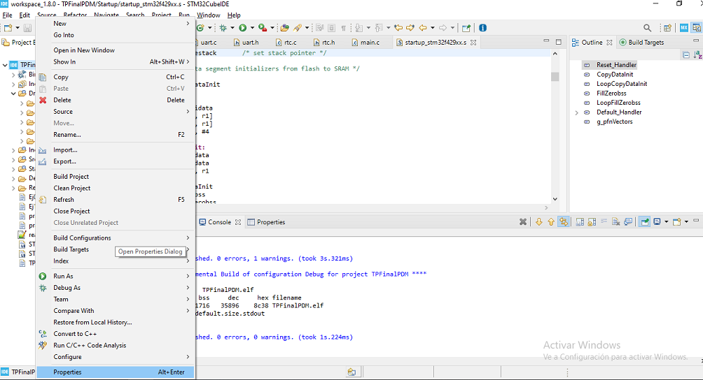
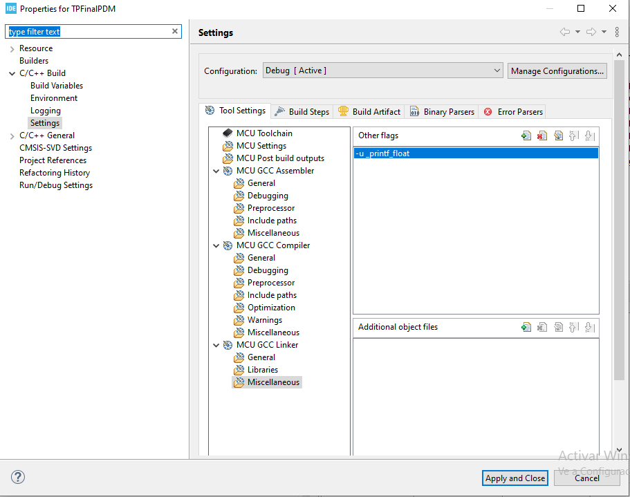

# TP Final de Programación de microcontroladores 

El presente proyecto calcula la hora siderea al presionar un pulsador. El puerto del pulsador se puede seleccionar mediante el código. 
Para realizar la compilación utilizando el template de la cátedra se deben modificar la función systemClock, se deben agregar 
las siguientes lineas. 

En el archivo stm32hal.x se debe descomentar la linea ''x1 '' 

Se debe realizar la compilacion del linker con la -u print__float 

A continuación se dejan las imágenes del procedimiento 
  
  

	